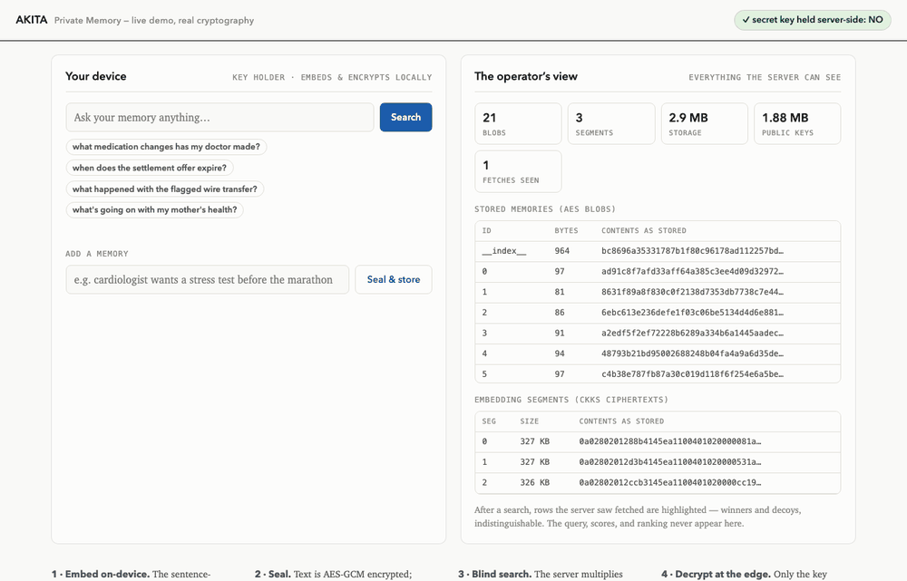

# Akita — memory your AI can use, that you can't read


Akita gives AI apps **per-user memory and search the operator provably
cannot read**: text sealed with AES-GCM, embeddings encrypted with CKKS,
keys that never leave the user's side — and search fast enough to ship
(**~95 ms warm end-to-end**, measured, results identical to plaintext
search).



*(Live version: `.venv/bin/python demos/demo_page/app.py` — real cryptography, no mocks.)*

**Status**: v0.1 prototype. Real cryptography, honest measurements,
**not audited** — don't protect production data with it yet
([SECURITY.md](SECURITY.md)).

## Install

```bash
pip install akita-fhe sentence-transformers
```

```python
from akita import Memory, MemoryServer, MiniLMEmbedder

server = MemoryServer()                      # the blind side
mem = Memory.open("user1", "a-passphrase-only-the-user-knows", server, MiniLMEmbedder())
mem.add(["dr chen increased the propranolol dose to 80mg"])
mem.search("what medication changes has my doctor made?", k=3)
# -> [{'id': 0, 'score': 0.54, 'text': 'dr chen increased the propranolol dose to 80mg', ...}]
```

The trust boundary: text is embedded **on the key holder's side**, sealed
with AES-GCM (each blob bound to its id, the index to a rollback counter,
so substituted or rolled-back server data fails closed), and its
embeddings are CKKS-encrypted before anything leaves. The server stores
blobs it cannot open and answers searches with one ciphertext×ciphertext
multiply per packed segment — it never sees the query, the scores, or the
ranking, and it refuses enrollment of any context containing a secret
key. `mem.audit()` fetches what the server holds and verifies client-side
that it cannot decrypt; `mem.wipe()` is crypto-shredding.

**See both sides live**: `.venv/bin/python demos/demo_page/app.py` →
http://127.0.0.1:8642 — your device on the left (ask anything), the
operator's actual view on the right: hex blobs, ciphertext segments,
`secret key: NO`, and which fetches it observed (winners + decoys,
indistinguishable). Real cryptography, no mocks.

## Measured (400 sensitive notes, real MiniLM embeddings, M1 Pro)

| Metric | Value |
|---|---|
| Store 400 notes (embed + encrypt + upload) | 0.8–2.4 s (~2–6 ms/note) |
| Semantic search, end to end | **0.24 s median** (~95 ms warm) |
| Server compute per search (encrypted corpus) | 145 ms — planner predicted 145 ms |
| Storage at rest | 45.5 KB/memory |
| One-time enrollment (public keys) | 1.9 MB |
| Delete | tombstone immediate; `compact()` re-packs physically |
| Operator's view | no secret key (asserted + auditable), hex-opaque blobs and segments |

Honest v0 costs, stated plainly: the search download scales with corpus
size (~230 KB per 8-memory segment — server-side aggregation is the
roadmap fix); fetch patterns are padded with decoy reads pending a PIR
stage; and key loss means memory loss — that's what "the operator cannot
read it" costs. Full run: `demos/demo6_private_memory.py`, numbers in
`results/`.

## The planner: know the cost before you encrypt

The other half of the library. FHE tooling fails silently and costs
unpredictably; the planner makes layout decisions explicit, validated,
and costed *before* anything encrypts:

```python
from akita import PipelineSpec, plan

print(plan(PipelineSpec("matvec_ranking", dim=384, n_items=1_000_000)).explain())
```
```
Akita plan — matvec_ranking
  security   CKKS, N=8192, modulus 200 bits (<= 218 for 128-bit), depth 1
  layout     dim 384 -> padded 512 (validated: divides 4096 slots), 245 chunk(s) x 4096 items
  est compute  639.74 core-s (127.95 s wall on 10 cores)
  est traffic  326 KB up / 59,976 KB down (+ 33.8 MB one-time public context)
  est cost     $0.008885 per query at full utilization ($0.017771 on a dedicated 10-core box) @ $0.05/core-hr
  warning    CKKS results must be revealed only to the secret-key holder. ...
```

Two facts from building this repo explain why it exists:

- **Silent corruption is one layout mistake away.** A 384-dim encrypted
  matmul in TenSEAL returns *wrong scores with no error* because 384
  doesn't divide the slot count
  (`tests/test_planner.py::test_the_trap_is_real` reproduces it). The
  planner makes that layout unrepresentable.
- **The cost model holds.** The planner predicted 13.1 s for a 100k-doc
  encrypted search this laptop measured at 14.0 s — within 7%.

v0 plans three workload shapes (`matvec_ranking`, `column_scoring`,
`memory_search`), refuses what shouldn't run under CKKS (comparisons →
routed to TFHE or the client), and executes plans on TenSEAL. Cost
constants are calibrated on this machine; expect ±30% elsewhere.

## Why any of this is fast enough: overhead is a workload-shape choice

The "100,000× overhead" of homomorphic encryption prices one encrypted op
against one plaintext op. Amortized over packed SIMD slots and priced per
*answer*, the picture changes — and it changes by orders of magnitude
depending on workload shape. Measured on one laptop core, same 128-bit
security:

| Workload | Server compute | Overhead vs plaintext | Cost |
|---|---|---|---|
| Encrypted search: query vs 16,384 docs (dim 128) | 2.6 s (0.54 s on 10 cores) | ~6,600× | $0.0022 / 1M docs |
| Encrypted scoring: logistic model, 4,096 records | 9.4 ms | ~330× | $0.00003 / 1M records |
| Exact rule (TFHE): 2 comparisons + AND/OR | 11.3 s / decision | ~10⁸× | route around it |

Correctness: search top-10 identical to plaintext (max error 5×10⁻⁸);
scoring error 4×10⁻⁸; TFHE exact by construction. In every demo the
server holds a **public context only** — the scripts assert it cannot
decrypt. An end-to-end private search engine over HTTP (12,288 real docs,
80/80 top-10 exact, 2.26 s median) lives in `demos/private_rag/`, with a
102,400-doc scale test (~$0.002/query).

Caveats that keep these numbers honest: baselines are best-of-10
single-thread numpy (FAISS-class baselines would raise the multipliers
~2–5×; the per-answer economics don't move); scale-test and prototype
figures price a dedicated machine for the query's wall time, while the
planner also reports the full-utilization basis — the two bracket real
deployments. The full reasoning with sources: [`docs/why.md`](docs/why.md).

## Security notes & limitations — read before relying on this

- **The privacy boundary ends where the prompt begins.** Akita protects
  memory *storage and search*: the operator cannot read stored memories,
  queries, scores, or rankings. But once your app decrypts retrieved
  memories and inserts them into an LLM prompt, their privacy depends on
  where inference runs — a local model, your own VPC, or a third-party
  API. Akita cannot protect what your app sends elsewhere; design your
  inference path accordingly and say so in your own privacy policy.
- **Parameters**: all CKKS contexts use N=8192 with ≤200-bit total
  coefficient modulus — within the 218-bit cap for 128-bit security in the
  homomorphicencryption.org standard. TFHE (Concrete) runs on its default
  parameter selection; we don't override its failure-probability target,
  so treat it as Concrete's default rather than a bound we claim.
- **IND-CPA-D / result disclosure**: CKKS is approximate. Decrypted
  results are safe to use *by the key holder*; revealing them to other
  parties (including the server) enables key-recovery-style attacks
  unless noise flooding is applied (Li–Micciancio, and the 2024 CCS line
  of work). Every plan the planner emits carries this warning. The demos
  here never disclose results beyond the key holder.
- **Access patterns**: fetching top-k results by ID reveals *which*
  entries matched (never the query or the scores). Decoy fetches pad
  this; closing it fully requires a PIR stage — production-proven
  elsewhere (Apple), not yet implemented here.
- **Model extraction** (scoring workloads): decrypted scores leak model
  information over many queries; rate-limit as you would any ML API.
- **Integrity**: FHE guarantees privacy, not that the server ran the
  right function. Verifiable FHE is still research.
- **This is a prototype**: TenSEAL/SEAL and Concrete are real libraries,
  but this repo's glue code is unaudited. Do not deploy as-is.

## Layout

- `akita/` — the SDK: `memory.py` (encrypted per-user memory),
  `planner.py`, `runtime.py`, `embedder.py`
- `tests/` — 16 tests incl. exactness-vs-plaintext, server blindness,
  the silent-corruption reproduction, and cost-model validation
- `demos/demo_page/` — the live split-screen demo
- `demos/demo6_private_memory.py` — Private Memory measured end to end
- `demos/private_rag/` — private search engine over HTTP + scale test
- `demos/demo1..3_*.py` — the micro-benchmarks (CKKS search, CKKS
  scoring, TFHE rules)
- `results/` — every number in this README, as JSON
- `docs/why.md` — the technical reasoning, with sources

## Developing from source

```bash
uv venv --python 3.12 .venv
uv pip install --python .venv/bin/python -e ".[demos,dev]"
.venv/bin/python -m pytest tests/ -q
```

or plain pip: `python3.12 -m venv .venv && .venv/bin/pip install -e ".[demos,dev]"`.
Exact tested versions: `requirements.lock.txt` (Python 3.12.13, macOS
14.6, M1 Pro). Requires Python 3.10–3.12 (TenSEAL has no 3.13+ wheels).

## Contributing, security, roadmap

Contributions that don't require cryptography expertise are the most
valuable right now — adapters, embedders, clients, and benchmarks on your
hardware: see [`CONTRIBUTING.md`](CONTRIBUTING.md). Vulnerabilities:
privately, per [`SECURITY.md`](SECURITY.md). Where this is going (and
what it deliberately isn't): [`ROADMAP.md`](ROADMAP.md). License:
Apache-2.0.
